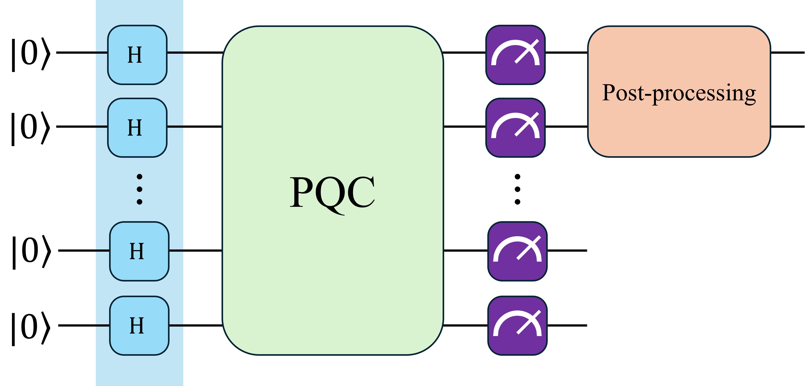

# **Summary of HCAL Channel Test Results**
---

This README file includes a summary of test results for the various parameters explored in my experiments.
Each entry in the table represents a specific configuration and its outcomes. The model used in the training is the proposed by 
[He-Liang et.al.](https://arxiv.org/abs/2010.06201), this model consist in a set of feature qubits which will represent the distribution
and a set of auxiliar qubits which gives the model more freedom, a post-processing is performed over the circuit output, first is divided by
a number $y \in [0, 1]$ which allows the circuit output to take values larger than 1 and fix the limitation of the maximum sum of the output 
probabilities.

- The first 5 test show that a smaller generator lr produces a better convergence, range tested: $gen\,\,lr \in [0.005, 0.4]$.
- Test 19-24 explore the impact of the shift values in the range $[0.0001, 0.05]$. the best performance was found between $0.001-0.005$
- Test 25-29 aims to find the optimal shift value for the circuit output

| id | qubits | auxiliar qubits | circuit depth | generators | rotations | lr gen | lr disc | batch size | resolution | optimizer | samples | epochs | y | cut threshold | shift | FID | RMSE | disc loss | gen loss | notes |
|---|---|---|---|---|---|---|---|---|---|---|---|---|---|---|---|---|---|---|---|---|
| 00 | 7 | 2 | 10 | 2 | ['Y'] | 0.005 | 0.005 | 1 | 8x8 | SGD | 1024 | 50 | 0.3 | 0.001 | 0 | 1.17e-04 | 5.99e-03 | 1.30e+00 | 7.12e-01 | analysis pending |
| 01 | 7 | 2 | 10 | 2 | ['Y'] | 0.001 | 0.005 | 1 | 8x8 | SGD | 1024 | 50 | 0.28 | 0.001 | 0 | 9.16e-05 | 3.99e-03 | 1.11e+00 | 7.11e-01 | analysis pending |
| 02 | 7 | 2 | 10 | 2 | ['Y'] | 0.001 | 0.005 | 1 | 8x8 | Adam | 1024 | 50 | 0.28 | 0.001 | 0 | 4.01e-04 | 6.78e-03 | 5.53e-02 | 2.93e+00 | analysis pending |
| 03 | 7 | 2 | 10 | 2 | ['Y'] | 0.001 | 0.001 | 1 | 8x8 | Adam | 1024 | 200 | 0.28 | 0.001 | 0 | 4.18e-05 | 3.50e-03 | 2.17e+00 | 7.07e+00 | analysis pending |
| 04 | 7 | 2 | 10 | 2 | ['Y'] | 0.001 | 0.005 | 1 | 8x8 | SGD | 1024 | 200 | 0.28 | 0.001 | 0 |
